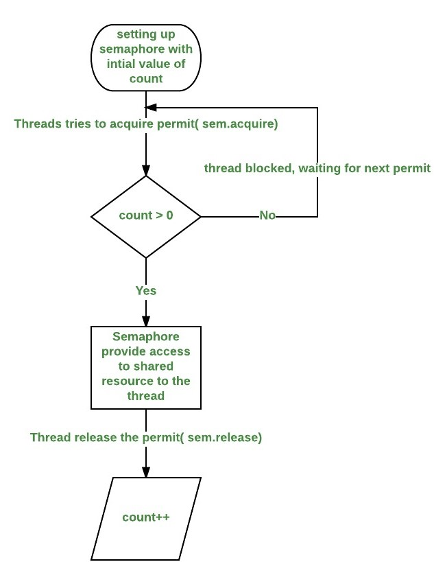

# 2.3 Hariak sinkronizatzea

Javako sinkronizazioa baliabide partekatuetarako edo kode atal kritikoetarako sarbidea kontrolatzeko prozesua da. Horrela bermatu daiteke hari bakarra edo hari kopuru mugatua bakarrik sar daitekeela eremu kritikoetara aldi berean. Javak sinkronizaziorako hainbat mekanismo eta hitz gako eskaintzen ditu.

## Monitoreak

<mark style="background-color:blue;">`syncronized`</mark> <mark style="background-color:blue;"></mark><mark style="background-color:blue;">hitz gakoa bloke eta metodo sinkronizatuak sortzeko erabiltzen da</mark>. Bloke edo metodo bat hitz gako horrekin definitzen denean, _monitorea_ esaten zaio. Bermatzen du hari bakar batek egin dezakeela bloke edo metodo sinkronizatu bat aldi berean. Metodo eta kode multzoei aplika dakieke. `volatile` aldagaientzako den gisakoa da `synchronized` metodoentzako. &#x20;

**Sinkronizatutako metodoa**ren adibidea:

```java
public synchronized void synchronizedMethod() {
    // Sinkronizatzeko kodea hemen doa
}
```

**Sinkronizatutako blokea**ren adibidea:

```java
public void someMethod() {
    synchronized (lockObject) {
        // Sinkronizatzeko kodea hemen doa
    }
}
```

<details>

<summary>Sinkronizatutako metodoak sinkronizatu gabekoekin konbinatzea</summary>

Klase bateko bi metodo sinkronizatuak badira, esan nahi da `syncronized` gisa deklaratu direlarik, sarraila bera erabiliko dute, eta giltzarrapo horrek bermatuko du hari bakar batek gauzatu ditzakeela metodo sinkronizatu horietako bat edo bestea aldi berean. Izan ere, `syncronized` metodo bati lotutako giltzarrapoa metodoa deitu duen objektuaren instantzia da.

Hala ere, hau ez da kasua metodo sinkronizatuak eta metodo sinkronizatu gabeak dituzten  klaseetan. Egoera honetan, sinkronizatu gabeko metodoa exekutatu nahi duen hariak EZ du itxaron behar sarraila eskuratzeko.

Adibidez:

<pre class="language-java"><code class="lang-java"><strong>public class MyClass {
</strong>    public synchronized void method1() {
        // Sinkronizatutako kodea method1en
    }

    public synchronized void method2() {
        // Sinkronizatutako kodea method2n
    }
    
    public void method3() {
        // Sinkronizatu gabeko kodea method2n
    }
}
</code></pre>

Kasu honetan, `method1` eta `method2` sarraila berean sinkronizatzen dira, `MyClass` objektuaren instantzia dena. Hari bat `method1` exekutatzen ari bada, beste hari bat blokeatuko da `method2` exekutatzen saiatzeagatik, harik eta lehen hariak bere exekuzioa osatu arte. Horrek bermatzen du metodo sinkronizatuetako bat bakarrik exekutatzen dela aldi berean klasearen instantzia jakin baterako.

Garrantzitsua da azpimarratzea klasearen instantzi asko badaude (bakoitza bere sarrailarekin) hari ezberdinek sinkronizatutako metodoak exekutatu ditzaketela kasu ezberdinetan. Hala ere, klasearen instantzi bakarra dagoenerako, sinkronizazioak bermatzen du hari bakar batek egin dezakeela metodo sinkronizatu bat une jakin batean.

</details>

### **`wait()` eta `notify()` / `notifyAll()` metodoak** <a href="#wait-and-notify-notifyall" id="wait-and-notify-notifyall"></a>

Monitoreak baldintzen bidez kudeatzen dira, zeharkatzen uzteko edo debeku erako hesi gisa. Kontrako kasuan blokeatuta egoeran sartuko dira hariak. Sekzio edo eremu horietan behar beharrezkoak dira  harien arteko komunikaziorako eta sinkronizaziorako metodoak.&#x20;

Normalean erabiltzen dira hari anitzek beren jarduerak koordinatu behar dituztenean edo hari batek baldintza jakin bat bete arte itxaron behar duenean aurrera egin aurretik. Esanda bezala, <mark style="background-color:blue;">metodo hauek bloke edo metodo sinkronizatuen barruan erabiltzeko diseinatuta daude, sinkronizazio egokia bermatzeko</mark>.

#### `wait()`:

`wait()` gainkargatutako metodoa erabili ohi da sinkronizatutako metodoen baitan. Hari batek `wait()` deitzean metodo sinkronizatu baten barruan, aldi baterako askatzen du objektuaren giltzarrapoa (kasu honetan, metodoa erabiltzen den objektuaren giltzarrapo inplizitua) eta itxaronaldi egoeran sartzen da.

#### **`notify()` eta `notifyAll()`:**

`notify()` eta `notifyAll()` metodoak ere erabili daitezke metodo sinkronizatuen barruan. Objektuaren zain dagoen haria edo objektu berdinaren zain dauden guztiak esnatzen dituzte (hurrenez hurren).


Hariak esnatzeko ordenari dagokionez `notify()` metodoaren portaera ez da FIFO (First-Input-First-Output) eran ematen, zoriz baizik. Arbitrarioa edo zehaztasunik gabea dela esaten da.&#x20;


Adibidez:

```java
class SharedResource {
    private boolean conditionMet = false;

    public synchronized void waitForCondition() {
        while (!conditionMet) {
            try {
                wait(); // Baldintzari zain
            } catch (InterruptedException e) {
                e.printStackTrace();
            }
        }
        //....
    }

    public synchronized void setConditionMet() {
        //....
        conditionMet = true;
        notifyAll(); // Zain dagoen hariari jakinaraztea
    }
}
```

Adibide honetan, `waitingForCondition` metodoa zain dago `conditionMet` aldagaia noiz aldatu, eta `setConditionMet` metodoak aldatzen dio balioa eta jakinarazpena zabaltzen zain dauden hariei.

Metodo sinkronizatuak horrela erabiltzeak erraztu egiten ditu `wait()`, `notify()` eta `notifyAll()` erabilerak, sinkronizazio eta hari arteko komunikazio logika metodoen barruan kapsulatuta egotea bermatzen duelako, kodea irakurgarriagoa eta mantenigarriagoa eginez.

## Sarraila aurreratuak edo _semaforoak_

Sarraila motak desberdinak daude (Lock) baina horien artean inplementazio aurreratuena daukatenak dira `Semaphore` klasekoak. <mark style="background-color:blue;">Monitoreek sarbide bakarra onartzen duten bitartean, semaforoek hainbat hariren sarbidea kontrolatzen dute</mark>.&#x20;

Semaforoak sinkronizatzeko era primitiboa dira, baliabide partekatu baterako edo <mark style="background-color:blue;">kode sekzio baterako sarbidea kontrolatzeko aukera</mark> ematen dutenak. Semaforoak erabiltzen dira sarbide kopuru muga duten baliabideen kontrolerako edo aldibereko eginkizun kopurua (konkurrentzia) mugatzeko.&#x20;

### Funtzionamendua

Oro har, baliabide partekatua eskuratu nahi duen hariak sarbidea eskatzen dio semaforoari:

* Semaforoaren zenbaketa zero baino handiagoa bada, hariak baimen bat eskuratzen du, semaforoaren baimenak batean murriztuz. Bestela, haria blokeatuta geratuko da baimena lortu arte. Hariak baliabide partekatua erabili duelarik, baimena askatzen du, eta horrek semaforoaren zenbaketa areagotzen du. Beste hari bat badago baimenaren zain, orduan hari horrek baimena lortuko du une horretan.

<figure><figcaption><p>Semaforoen ohiko jarduna. Hala ere, badago besterik. </p></figcaption></figure>


Semafoak 0 baimen kopuruz hasieratzen direneko kasu partikularra da bestelako sinkrizazio erabilera: bilatzen dena da eremu kritiko batekin baliatzea baino, atzetik datorren haria beti izatea lehena exekutatzen. Hark egingo bailuke `release()` deitu lehenak `acquire()` egin eta zain legokeen bitartean aurrea hartuz. Gogoan izan 0 baimen kopurua zegoela bana asktu ostetik batuketa egiten zaiola eta preso legokeen haria librea litzatekeela planfikadorearen zerbitzura.&#x20;


Javak `semaphore` klasea dauka eskuragarri `java.util.concurrent` sortan.


Semaforoen metodo eraikitzailea gainkargaturik dago, `(int permits)` eta `(int permits, boolean fair)`

`fair` true denetan (_bidezkoa,_ euskaraz), zain dauden harien trataera ordenatua izango da: FIFO (_First Input First Output_). Bestela, auskalo: planifikadoreraren eta sistema-eragilearen menpekoa izango da hautua.&#x20;


Semaforo klaseak bi metodo nagusi ditu: `acquire()` eta `release()` eta metodo gainkargatuak. Gainera, semaforoa sortzean hasierako baimen kopurua zehazteko aukera ematen du.

* `acquire()`: hari batek eskatu nahi duenerako baliabide edo kode partekatuaren atal kritikorako sarbidea. Sarbide kopurua agortu ez baldin bada, hariak baimen bat hartu eta barrura sartzen da. Bestela, blokeatu egingo da baimena lortu arte.
* `release()`: baimen bat askatzeko erabiltzen da, hariak baliabidea erabiltzen amaitu baitu honezkero. Baimen eskuragarrien kopurua batean handitzen da.

Hona hemen semaforo bat baliabide partekatu baterako sarbidea kontrolatzen:

```java
package unieibar;
import java.util.concurrent.Semaphore;

public class SemaphoreExample {
    public static void main(String[] args) {
        Semaphore semaphore = new Semaphore(3); // Aldiberean hiru harirentzat sarbidea

        // Lambda esapidea
        Runnable task = () -> {
            try {
                semaphore.acquire(); // Baimena eskatzea
                System.out.println(Thread.currentThread().getName() + " is using the resource.");
                Thread.sleep(2000); // Zerbait egiten legokeenaren itxura ematea
            } catch (InterruptedException e) {
                e.printStackTrace();
            } finally {
                semaphore.release(); // Baimena askatzea
                System.out.println(Thread.currentThread().getName() + " has finished using the resource.");
            }
        };

        Thread thread1 = new Thread(task);
        Thread thread2 = new Thread(task);
        Thread thread3 = new Thread(task);
        Thread thread4 = new Thread(task);

        thread1.start();
        thread2.start();
        thread3.start();
        thread4.start();
    }
}
```

Adibide honetan, semaforo bat sortu da sarrera gisa 3 balioarekin. Hau da, hiru harik baino ez dute aldiberean lortuko sekziora sartzea. Gero lau hari sortu direnetik, baliabidea partekatzea simulatuko dute. Hari batek semaforoa deitzen duenean, baimena eskatuko du. Baimenak badaude (3 da muga), hariak aurrera egingo du. Bestela, baimena lortu arte itxarongo du. Lana amaitu ondoren, hariak semaforoari deitu eta baimena askatuko du.

Ondorioz, gehienez ere hiru hari erabil daitezke aldi berean, eta laugarren haria zain egon behar da baimena eskuratu bitartean. Semaforoak erabilgarriak dira gaitasun mugatuko baliabideetarako sarbidea kontrolatu nahi den egoeretarako edo konkurrentzia kopurua mugatu nahi den kasuetarako.

<details>

<summary><code>Semaphore</code> klasearen metodoak</summary>

The `Semaphore` class in Java provides several methods to control permits and manage thread synchronization. Here are the principal methods and some of their overloaded variants:

1.  **`acquire()`:**

    * Acquires a permit from the semaphore.
    * If no permits are available, the calling thread will block until a permit becomes available.

    **Overloaded variants:**

    * `acquire(int permits)`: Acquires the specified number of permits.
    * `acquireUninterruptibly()`: Similar to `acquire()` but does not respond to interruption. If the thread is interrupted, it will continue to wait for a permit.
    * `acquireUninterruptibly(int permits)`: Acquires the specified number of permits without responding to interruption.
2.  **`release()`:**

    * Releases a permit, increasing the number of available permits by one.
    * If there are waiting threads, one of them will be unblocked and receive a permit.

    **Overloaded variants:**

    * `release(int permits)`: Releases the specified number of permits.
3. **`availablePermits()`:**
   * Returns the number of available permits at a given moment.
4.  **`tryAcquire()`:**

    * Attempts to acquire a permit without waiting.
    * Returns `true` if a permit was acquired, or `false` if no permit was available at that moment.

    **Overloaded variants:**

    * `tryAcquire(int permits)`: Attempts to acquire the specified number of permits without waiting.
5.  **`tryAcquire(long timeout, TimeUnit unit)`:**

    * Attempts to acquire a permit, waiting for the specified time.
    * Returns `true` if a permit was acquired within the specified time, or `false` if not.

    **Overloaded variants:**

    * `tryAcquire(int permits, long timeout, TimeUnit unit)`: Attempts to acquire the specified number of permits, waiting for the specified time.
6. **`drainPermits()`:**
   * Drains all available permits from the semaphore and returns the number of permits acquired. This method is useful for situations where you want to temporarily acquire and then release multiple permits.
7. **`getQueuedThreads()`:**
   * Returns a collection of threads that are currently waiting to acquire permits from the semaphore. This method provides insight into the threads that are waiting in the semaphore's queue.
8. **`getQueueLength()`:**
   * Returns the number of threads currently waiting in the semaphore's queue to acquire permits.
9. **`hasQueuedThreads()`:**
   * Checks if there are any threads currently waiting in the semaphore's queue to acquire permits. It returns `true` if there are waiting threads, and `false` otherwise.
10. **`isFair()`:**
    * Determines if the semaphore has been created with a fair ordering policy. A fair semaphore grants permits in the order in which threads requested them. It returns `true` if the semaphore is fair, and `false` if it is not.
11. **`reducePermits(int reduction)`:**
    * Reduces the number of available permits by the specified reduction value. This method allows you to decrease the number of permits held by the semaphore, which can be useful in certain scenarios where you need to temporarily limit concurrency by taking back permits.

These methods provide different ways to control and manage permits in a `Semaphore`. You can use them based on your specific synchronization and concurrency requirements.

</details>


Hari bakarra onartzen duten semaforoek edo bitarrek, **Mutex** izena jasotzen dute (_Mutual exclusion_).&#x20;


<details>

<summary>Orduan: synchronized ala mutex? Zein da aldea?</summary>

* **Synchronized**: erabili hau kasu sinpleagoetarako, objektu baten barruan metodoak sinkronizatu behar dituzunerako. Erabiltzeko eta ulertzeko errazagoa da, baina objektu guztia blokeatzen du, eta baliteke aplikazio konplexuetan eraginkorra ez izatea.&#x20;

- **Mutex**: Erabili hau konkurrentziaren gaineko kontrol zehatzagoa behar duzunean. Leku batean kokatuagoa denerako.&#x20;

</details>

<details>

<summary>Adibide 1</summary>

```java
// java program to demonstrate 
// use of semaphores Locks 
import java.util.concurrent.*; 

//A shared resource/class. 
class Shared 
{ 
	static int count = 0; 
} 

class MyThread extends Thread 
{ 
	Semaphore sem; 
	String threadName; 
	public MyThread(Semaphore sem, String threadName) 
	{ 
		super(threadName); 
		this.sem = sem; 
		this.threadName = threadName; 
	} 

	@Override
	public void run() { 
		
		// run by thread A 
		if(this.getName().equals("A")) 
		{ 
			System.out.println("Starting " + threadName); 
			try
			{ 
				// First, get a permit. 
				System.out.println(threadName + " is waiting for a permit."); 
			
				// acquiring the lock 
				sem.acquire(); 
			
				System.out.println(threadName + " gets a permit."); 
		
				// Now, accessing the shared resource. 
				// other waiting threads will wait, until this 
				// thread release the lock 
				for(int i=0; i < 5; i++) 
				{ 
					Shared.count++; 
					System.out.println(threadName + ": " + Shared.count); 
		
					// Now, allowing a context switch -- if possible. 
					// for thread B to execute 
					Thread.sleep(10); 
				} 
			} catch (InterruptedException exc) { 
					System.out.println(exc); 
				} 
		
				// Release the permit. 
				System.out.println(threadName + " releases the permit."); 
				sem.release(); 
		} 
		
		// run by thread B 
		else
		{ 
			System.out.println("Starting " + threadName); 
			try
			{ 
				// First, get a permit. 
				System.out.println(threadName + " is waiting for a permit."); 
			
				// acquiring the lock 
				sem.acquire(); 
			
				System.out.println(threadName + " gets a permit."); 
		
				// Now, accessing the shared resource. 
				// other waiting threads will wait, until this 
				// thread release the lock 
				for(int i=0; i < 5; i++) 
				{ 
					Shared.count--; 
					System.out.println(threadName + ": " + Shared.count); 
		
					// Now, allowing a context switch -- if possible. 
					// for thread A to execute 
					Thread.sleep(10); 
				} 
			} catch (InterruptedException exc) { 
					System.out.println(exc); 
				} 
				// Release the permit. 
				System.out.println(threadName + " releases the permit."); 
				sem.release(); 
		} 
	} 
} 

// Driver class 
public class SemaphoreDemo 
{ 
	public static void main(String args[]) throws InterruptedException 
	{ 
		// creating a Semaphore object 
		// with number of permits 1 
		Semaphore sem = new Semaphore(1); 
		
		// creating two threads with name A and B 
		// Note that thread A will increment the count 
		// and thread B will decrement the count 
		MyThread mt1 = new MyThread(sem, "A"); 
		MyThread mt2 = new MyThread(sem, "B"); 
		
		// stating threads A and B 
		mt1.start(); 
		mt2.start(); 
		
		// waiting for threads A and B 
		mt1.join(); 
		mt2.join(); 
		
		// count will always remain 0 after 
		// both threads will complete their execution 
		System.out.println("count: " + Shared.count); 
	} 
} 

```

Irteera:&#x20;

```
Starting A
Starting B
A is waiting for a permit.
B is waiting for a permit.
A gets a permit.
A: 1
A: 2
A: 3
A: 4
A: 5
A releases the permit.
B gets a permit.
B: 4
B: 3
B: 2
B: 1
B: 0
B releases the permit.
count: 0  
```

Azalpena:&#x20;

* Exekuzio ordenak aldatu litezke iterazio bakoitzean, baina, emaitza ez da aldatuko: sinkronizatuta daude hariak!
* Programak semaforo bat erabiltzen du kontaketa aldagaiaren sarbidea kontrolatzeko, hau da, aldagai estatiko bat partekatutako klasearen barruan. `Shared.count` bost aldiz gehitzen da A hariaren bidez, eta bost aldiz gutxitzen B hariaren bidez. Bi hariek Shared.cpount aldagaia aldi berean eragozteko, semaforoaren baimen muga dago. Behin sekzio kritikoa igarota, sarbidea libre geratzen da. Horrela, aldi berean hari bakarra sartuko da `Shared.count`ean.&#x20;
* Orain, ikus `sleep()` metodoaren erabilera `MyThread` klasearen barruko `run()` deian dagoena. `Shared.count` aldagaiaren eguneraketetarako sarbideak semaforoak sinkronizatzen dituela "frogatzeko" jarri da hor. Haria une batez geldiarazten du desfasea sortuz. Horrek, normalean, bigarren hariak aurrea hartzea ahalbidetu behar luke. Baina, semaforoaren eraginez, bigarren hariak lehenengoak baimena eman arte itxaron behar du. Ez den beteko baldintza, lehen haria sekziotik irteten den arte. Horrela, `Shared.count` bost aldiz gehituko da A hariaren bidez, eta gero bost aldiz kenduko B hariaren bidez.&#x20;
* Semaforoa erabili gabe, `Shared.count` sekziorako sarbidea bi harien menpe legoke eta bataren zein bestearen eguneraketak elkarri eragingo lieke, okerrera. Hori baieztatzeko, iruzkindu `acquire()` eta `release()`. Programa exekutatu ezazu, eta ikusiko duzu sarbideak sinkronizaturik egoteari utzi diola, eta, hortik, emaitz okerrak.

</details>

<details>

<summary>Adibide 2</summary>

```java
// Java program to demonstrate 
// methods of Semaphore class
import java.util.concurrent.*;

class MyThread extends Thread {
    Semaphore sem;
    String threadName;

    public MyThread(Semaphore sem, String threadName) {
        super(threadName);
        this.sem = sem;
        this.threadName = threadName;
    }

    @Override
    public void run() {

        // First, get a permit.
        System.out.println(threadName + " is waiting for a permit.");

        try {
            // acquire method
            sem.acquire();
        } catch (InterruptedException e) {
            e.printStackTrace();
        }

        System.out.println(threadName + " gets a permit");

        // Now, the critical section
        // other waiting threads will wait until this
        // thread releases the lock
        for (int i = 0; i < 2; i++) {
            // hasQueuedThreads() method
            boolean b = sem.hasQueuedThreads();
            if (b)
                // getQueuedLength() method
                System.out.println("Length of Queue : " + sem.getQueueLength());

            // Now, allowing a context switch -- if
            // possible.
            try {
                Thread.sleep(10);
            } catch (InterruptedException e) {
                e.printStackTrace();
            }
        }

        // Release the permit.
        System.out.println(threadName + " releases the permit.");

        // release() method
        sem.release();
    }
}

// Driver class
public class SemaphoreDemo {

    public static void main(String args[]) throws InterruptedException {
        // Creating a Semaphore object
        // with a number of permits 3 and fairness true
        Semaphore sem = new Semaphore(3, true);

        // isFair() method
        System.out.println("Is fairness enabled : " + sem.isFair());

        // Main thread tries to acquire 2 permits
        // tryAcquire(int permits) method
        sem.tryAcquire(2);

        // availablePermits() method
        System.out.println("Available permits : " + sem.availablePermits());

        // drainPermits() method
        System.out.println(
                "Number of permits drained by the main thread: " + sem.drainPermits());

        // Permit released by the main thread
        sem.release(1);

        // Creating two threads with names A and B
        MyThread mt1 = new MyThread(sem, "A");
        MyThread mt2 = new MyThread(sem, "B");

        // Starting thread A
        mt1.start();

        // Starting thread B
        mt2.start();

        // toString method
        System.out.println(sem.toString());

        // Waiting for threads A and B
        mt1.join();
        mt2.join();
    }
}
```

Irteera:&#x20;

```
is Fairness enabled : true
Available permits : 1
number of permits drain by Main thread : 1
java.util.concurrent.Semaphore@5b6f7412[Permits = 1]
A is waiting for a permit.
A gets a permit
B is waiting for a permit.
Length of Queue : 1
A releases the permit.
B gets a permit
B releases the permit.
```

</details>

## Ekoizle-kontsumitzaile eredua

Sistema eragileen sinkronizazio-arazo klasikoa da. Bi prozesu mota sartzen dira tartean: ekoizleak, datuak sortzen dituztenak; eta, kontsumitzaileak, datu horiek prozesatzen dituztenak. Biltegi bera partekatzen dutelarik egin ere. Erronka da bermatzea ekoizleak ez dizkiola datuak gehituko beteta dagoen biltegiari, eta, kontsumitzaileak ez dituela hustutako biltegian datuak ezabatzen. Hori guztia, biltegia eskuratzeko lehia gidatu bitartean. Sinkronizazio mekanismo egokiak behar dira erronkari eusteko eta prozesu parearen arteko koordinazio eraginkorra ahalbidetzeko.

Orokorrean lau klaserekin erantzuten zaio erronkari:

1. **Ilara** edo kola: sinkronizatzeko datuen ilara.&#x20;
2. **Ekoizlea**: ilaran edo kolan datuak sartzeko haria.
3. **Kontsumitzailea**: ilarako sarrerak kontsumitzen ari den haria.
4. **Nagusia**: arduratzen da sortzeaz kola bakarra, eta, abiarazteaz ekoizlea eta kontsumitzailea.

Azkenik, ekoizleen eta kontsumitzaileen eredua harien esku uztean kasuistika bat nabarmenduko dugu: ordena. Monitoreak erabiltzeak probestuko du hariek ez dutela elkarrekin gatazkarik sortuko, baina baliabidea askatzen dutenean (monitoreak kontrolpean daukan funtzioa edo objektua) edozeinek hartu dezake berriz agintea: kontsumitzaileak zein ekoizleak, hain zuzen ere. Txandaka egitea beharrezkoa den kasuetan erabiliko den programazio egiturari erreparatu beharko zaio: monitoreak, semaforoak eta hodien artean, alegia. &#x20;

### &#x20;Zorizko ordenan

#### Monitoreak erabiliz

Sinkronizatutako metodo pareak emango digu hariak koordinatzeko edo sinkronizatzeko parada: gogoratu sinkronizatuta dauden bi bloke zati edo metodo kanporatzaileak direla, hau da, hari bat baldin badago batean beste guztiek itxaron beharko dutela hark exekuzio eremu horretakoak egin arte. Monitoreen erabilerarekin eta baldintzak kudeatuz, programatzaileak erabakitzen du zein unetan zain izan hari batzuk edo besteak. Horrela eginda, baliabide berdinagatik lehian dabiltzan kontsumitzaileak eta ekoizleak ez diote kalterik egingo azken produktuari.&#x20;



```java
package unieibar;
public class ProducerConsumer {
    public static void main(String[] args) {
        StockStore s = new StockStore (10);
        Producer p = new Producer(s);
        Consumer c = new Consumer(s);
        try {
             
            p.start();
            c.start();
         
        } catch (InterruptedException ex) {
            System.out.println(ex.getMessage());
        }
    }
}
```



```java
package unieibar;
public class Producer extends Thread {
    private StockStore store;
    private final String words= "abcdefghijklmnopqrstuvxyz";
    
    public Producer(StockStore store) {
        this.store= store;
    }
    
    public void run() {
        while (true) {
            // Jaso hitza ausaz
            char c = words.charAt((int) (Math.random() * words.length()));
            // Produzitzea
            store.produce(c);
            System.out.println("Char added to " + c + " store");
            try {
                // Itxarote mugatua 0 eta 4 segundu tartekoa 
                sleep((int) (Math.random() * 4000));
            } catch (InterruptedException e) { }
        }
    }
}
```



```java
package unieibar;
public class Consumer extends Thread {
    private StockStore store;
    
    public Consumer(StockStore store) {
        this.store= store;
    }
    
    public void run() {
        while (true) {
            // Kontsumitzea
            char c= store.consume();
            System.out.println("Get character " + c + " from store");
            try {
                // Itxarote mugatua 0 eta 4 segundu tartekoa 
                sleep((int) (Math.random() * 4000));
            } catch (InterruptedException e) { }
        }
    }
}
```



```java
package unieibar;
public class StockStore {
    private char store[];
    private int next;
     
    // biltegiaren egoera adieraztea
    private boolean isFull;
    private boolean isEmpty;
    
    public StockStore(int lenght) {
        store = new char[lenght];
        next= 0;
        isFull= false;
        isEmpty= true;
    }

    // Metodoa bufferrekoa erabiltzeko (kontsumitzea)
    public synchronized char consume() {
        // Ezin kontsumitu ez baldin badago gordeta!
        while (isEmpty == true) {
            try {
                wait();
            } catch (InterruptedException e) { }
        }
        // Kontatzailea txikitu karakterea kontsumitzen ari denez gero
        next--;
        // Egiaztatu azken karakterea kontsumitu den
        if (next == 0) {
            isEmpty = true;
        }
        // Biltegia ezin da egon beteta, kontsumitu denez honezkero. Jakinarazi
        isFull = false;
        notifyAll();
 
        // Karakterea itzultzea eskatu duen hariari
        return (store[next]);
    }
 
    // Metodoa karaktereak gordetzeko biltegian
    public synchronized void produce(char c) {
        // Zain egon karaktere berriarentzat lekua egon arte
        while (isFull == true) {
            try {
                wait();
            } catch (InterruptedException e) { }
        }
        // Sartu karakterea hurrengo hutsunean
        store[next] = c;
        // Mugitu hurrengo posiziora
        next++;
        isEmpty = false;
        // Egiaztatu biltegia bete den
        if (next == this.store.length) {
            isFull = true;
        }
        isEmpty = false;
        notifyAll();
    }
}
```



### Ordena txandakatuan

#### Pipe egiturekin

Harien artean komunikatzeko garaian ohikoena objektu osoak partekatzea izango da byte segidak baino. Baina azken hau baldin bada egin  beharreko hautua, aukera ona dira pipe egiturak. &#x20;

Hodi batek sarrerako korronte bat eta irteerako korronte bat konektatzen ditu.

Diseinuz jada, pipeekin kudeatzen diren sarrera eta irteerek ekoizle-kontsumitzaile eredua darabilte.  Ekoizleak datuak ekoizten ditu eta kontsumitzaileak datuak kontsumitzen.

Halako S/I hodietan, bi mutur irudikatzen dituzten bina korronte sortzen ditugu. `PipedOutputStream` objektu batek mutur bat irudikatzen du, eta `PipedInputStream` objektu batek beste muturra. Bi muturrak konektatzeko erabiltzen da `connect()` metodoa bi objektuetako edozeinetan.

Objektu bat eraikitzaileari pasatuz ere konekta ditzakegu beste objektu bat sortzen dugunean.

Kode honek bi modu erakusten ditu hodi baten bi muturrak sortzeko eta konektatzeko:

```java
PipedInputStream pis  = new PipedInputStream(); 
PipedOutputStream pos  = new PipedOutputStream(); 
pis.connect(pos); /* bi muturrak konektatzea  */
```

Lehenengo metodoak hodien sarrera- eta irteera-fluxu bat sortzen du, eta konektatu egiten ditu `connect` metodoa erabiliz.

Beste honi heldu, bestela esanda bezala egiteko (eraikitzaileari objektua pasatzearena, alegia):

```java
PipedInputStream pis  = new PipedInputStream(); 
PipedOutputStream pos  = new PipedOutputStream(pis);
```

Bigarren metodoak hodien sarrera- eta irteera-fluxuak sortzen ditu, eta konektatu egiten ditu sarrerako korrontea irteerako fluxu-eraikitzaileari pasatzean, hain zuzen ere.

Hodiaren bi muturrak konektatu ondoren, datuak ekoitzi eta kontsumitu ditzakegu.

Datuak sortzen ditugu `PipedOutputStream` objektuaren `write()` idazketa metodoetako bat erabiliz. Pipe baten irteera muturrean idazten dugun unean, eskuragarri bihurtzen da hodiaren beste muturrean (sarreran).

`PipedInputStream`en `read()` irakurketa metodoa erabiliko dugu orduan hoditik jasotzeko informazioa. Hodien sarrera-fluxua blokeatu egiten da datuak eskuragarri ez badaude, hoditik irakurtzen saiatzen garenean.

Fluxua tututik idazten eta irakurtzen den bitartean datuak gordetzeko edukiera mugatua duen bufer bat du.

Hodiaren ahalmena ezartzen da sortzerakoan. Gainezka egiten baldin badu, hodian idazteko saiakera galtzen da.

Hurrengo kodeak sarrera eta irteera fluxuak komunikatzeko 2048 byteko edukieradun buferra darabil:

```java
PipedOutputStream pos  = new PipedOutputStream(); 
PipedInputStream pis  = new PipedInputStream(pos, 2048);
```

Erabileren artetik bat da datuak hari batetik bestera transferitzea. Bi harien arteko sinkronizazioa bermatzen du irakurtzeko eta idazteko aipatu blokeoak.

Adibidez:&#x20;

```java
package unieibar;
import java.io.PipedInputStream;
import java.io.PipedOutputStream;

public class Main {
  public static void main(String[] args) throws Exception {
    PipedInputStream pis = new PipedInputStream();
    PipedOutputStream pos = new PipedOutputStream();
    pos.connect(pis);    
    Runnable producer = () -> produceData(pos);
    Runnable consumer = () -> consumeData(pis);
    new Thread(producer).start();
    new Thread(consumer).start();
  }  public static void produceData(PipedOutputStream pos) {
    try {
      for (int i = 1; i <= 50; i++) {
        pos.write((byte) i);
        pos.flush();
        System.out.println("Writing: " + i);
        Thread.sleep(500);
      }
      pos.close();
    } catch (Exception e) {
      e.printStackTrace();
    }
  }
  public static void consumeData(PipedInputStream pis) {
    try {
      int num = -1;
      while ((num = pis.read()) != -1) {
        System.out.println("Reading: " + num);
      }
      pis.close();
    } catch (Exception e) {
      e.printStackTrace();
    }  }
}
```

Irteera:&#x20;

```
Writing: 1
Reading: 1
Writing: 2
Reading: 2
Writing: 3
Reading: 3
Writing: 4
Reading: 4
Writing: 5
Reading: 5
```

Beste bat, datuak byteka idatziz:&#x20;

```java
package unieibar;
import java.io.IOException;
import java.io.PipedInputStream;
import java.io.PipedOutputStream;

public class PipeExample {

    public static void main(String[] args) throws IOException {

        final PipedOutputStream output = new PipedOutputStream();
        final PipedInputStream  input  = new PipedInputStream(output);


        Thread thread1 = new Thread(new Runnable() {
            @Override
            public void run() {
                try {
                    output.write("Hello world, pipe!".getBytes());
                } catch (IOException e) {
                }
            }
        });


        Thread thread2 = new Thread(new Runnable() {
            @Override
            public void run() {
                try {
                    int data = input.read();
                    while(data != -1){
                        System.out.print((char) data);
                        data = input.read();
                    }
                } catch (IOException e) {
                }
            }
        });
        thread1.start();
        thread2.start();
    }
}
```

#### Mutexak erabiliz

Honezkero hariak sinkronizatzeko arazo hau erantzun dugu pipeak erabiliz zein monitoreak eta baldintzak kudeatuz. Azken saiakera honetan semafoekin kudeatuko da partekatzeko ilara, eta huragatik lehiatzen diren ekoizlea eta kontsumitzailea.&#x20;

```java
// Java implementation of a producer and consumer 
// that use semaphores to control synchronization. 
package unieibar;
import java.util.concurrent.Semaphore; 

class Q { 
	// an item 
	int item; 

	// semCon initialized with 0 permits 
	// to ensure put() executes first 
	static Semaphore semCon = new Semaphore(0); 

	static Semaphore semProd = new Semaphore(1); 

	// to get an item from buffer 
	void get() 
	{ 
		try { 
			// Before consumer can consume an item, 
			// it must acquire a permit from semCon 
			semCon.acquire(); 
		} 
		catch (InterruptedException e) { 
			System.out.println("InterruptedException caught"); 
		} 

		// consumer consuming an item 
		System.out.println("Consumer consumed item : " + item); 

		// After consumer consumes the item, 
		// it releases semProd to notify producer 
		semProd.release(); 
	} 

	// to put an item in buffer 
	void put(int item) 
	{ 
		try { 
			// Before producer can produce an item, 
			// it must acquire a permit from semProd 
			semProd.acquire(); 
		} 
		catch (InterruptedException e) { 
			System.out.println("InterruptedException caught"); 
		} 

		// producer producing an item 
		this.item = item; 

		System.out.println("Producer produced item : " + item); 

		// After producer produces the item, 
		// it releases semCon to notify consumer 
		semCon.release(); 
	} 
} 

// Producer class 
class Producer implements Runnable { 
	Q q; 
	Producer(Q q) 
	{ 
		this.q = q; 
		new Thread(this, "Producer").start(); 
	} 

	public void run() 
	{ 
		for (int i = 0; i < 5; i++) 
			// producer put items 
			q.put(i); 
	} 
} 

// Consumer class 
class Consumer implements Runnable { 
	Q q; 
	Consumer(Q q) 
	{ 
		this.q = q; 
		new Thread(this, "Consumer").start(); 
	} 

	public void run() 
	{ 
		for (int i = 0; i < 5; i++) 
			// consumer get items 
			q.get(); 
	} 
} 

// Driver class 
class PC { 
	public static void main(String args[]) 
	{ 
		// creating buffer queue 
		Q q = new Q(); 

		// starting consumer thread 
		new Consumer(q); 

		// starting producer thread 
		new Producer(q); 
	} 
} 
```

Irteera:

```
Producer produced item : 0
Consumer consumed item : 0
Producer produced item : 1
Consumer consumed item : 1
Producer produced item : 2
Consumer consumed item : 2
Producer produced item : 3
Consumer consumed item : 3
Producer produced item : 4
Consumer consumed item : 4
```

**Explanation :** As you can see, the calls to **put()** and **get( )** are synchronized, i.e. each call to put() is followed by a call to get( ) and no items are missed. Without the semaphores, multiple calls to put() would have occurred without matching calls to get(), resulting in items being missed. (To prove this, remove the semaphore code and observe the results.)

**The sequencing of put() and get() calls is handled by two semaphores:** **semProd** and **semCon**.

* Before put( ) can produce an item, it must acquire a permit from semProd. After it has produce the item, it releases semCon.
* Before get( ) can consume an item, it must acquire a permit from semCon. After it consumes the item, it releases semProd.
* This “give and take” mechanism ensures that each call to put( ) must be followed by a call to get( ).
* Also notice that semCon is initialized with no available permits. This ensures that put( ) executes first. The ability to set the initial synchronization state is one of the more powerful aspects of a semaphore.
