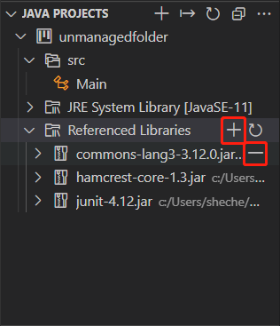

# 5.1 FTP

Fitxategiak transferitzeko protokoloa (FTP) sare-protokolo estandar bat da, sarearen bidez bezeroen eta zerbitzarien artean fitxategiak transferitzeko erabiltzen dena.&#x20;

FTP Javan inplementatzeari esker programatu daitezke aplikazioak sarearen bidez fitxategiak transferitu ahalko dituztenak. Apache Commons Net bezalako liburutegiek metodo egokiak eskaintzen dituzte FTP zerbitzarietara konektatzeko eta fitxategiak igo, deskargatu eta zerrendatzeko bezalako eragiketak egiteko. Oinarrizko kontzeptu horiek ulertzean FTP aplikazio sendoak eraikiko dituzue uneko behar espezifikoetara egokituko direnak.

Javan FTP garatzean bezeroaren atalaz arduratuko gara. Zerbitzariko karpetan dauden fitxategiak ikusi, igo edo deskargatu ahalko ditugu, besteak beste.


#### FTP zerbitzariko hasierako ezarpenak

Ezer baino lehen FTP zerbitzari baterakosarbidea eskuratu beharra dago, bestela ezingo baita inolako bezerorik konfiguratu. Biderik motzena zerbitzari propioa instalatzea dugu: FileZilla FTP Server. Aldiz, bezero gisa, FileZilla FTP Client edo WinSCP. &#x20;

Zerbitzariaren ezarpenetan erabiltzailea sortu behar da, bertara konetatzeko erabiliko dena, hain zuzen ere. Zehaztu beharrekoak dira: izena, pasahitza eta partekatuko den karpetaren helbide osoa. Esaterako: "C:\FTP".


## Apache Commons Net liburutegia

Apache Commons Net liburutegiak hainbat bilduma ditu eskuragai biltzen dituztenak hainbat sare protokolo zein tresna. Horien artean daude FTP zerbitzuari dagozkion klaseak: `FTP,` `FTPClient` edo `FTPFile` klaseei esker FTP bezero aplikazioak sortu daitezke FTP zerbitzariekin komunikatzeko.&#x20;

### `org.apache.commons.net.ftp` bilduma eranstea IDE batean

Jarraibideak erabilitako IDEtan Apache Commons Net liburutegia txertatzeko:&#x20;

| Visual Studio Code                                                                                                                                                                                                                                                                                                                                                                                                | Apache Netbeans                                                                                                                                                                                                                                                                                                                                                                                                                                                               |
| ----------------------------------------------------------------------------------------------------------------------------------------------------------------------------------------------------------------------------------------------------------------------------------------------------------------------------------------------------------------------------------------------------------------- | ----------------------------------------------------------------------------------------------------------------------------------------------------------------------------------------------------------------------------------------------------------------------------------------------------------------------------------------------------------------------------------------------------------------------------------------------------------------------------- |
| <ol><li>Deskargatu <a href="https://commons.apache.org/net/download_net.cgi">commons-net.jar</a> azken bertsioa.</li><li>Liburutegien erreferentzia txertatu (irudian bezala) edo lib karpeta sortu eta bertan jar fitxategia atera zipetik eta erantsi klaseak dituen fitxategiaren maila berdinean. </li></ol><p></p> | <ol><li>Download this <a href="https://commons.apache.org/net/download_net.cgi"><strong>commons-net.jar</strong></a> file</li><li>Extract the binaries zip file</li><li>Copy the Jar file</li><li>Place the file in lib folder or root folder of your project.</li><li>Right click on the project -> Libraries folder inside Netbeans</li><li>Click on <strong>"Add JAR/Folder"</strong></li><li>Browse the <strong>Commons-net.jar</strong> file and click on open</li></ol> |


**Dependentzia kudeatzaileen erabilera**

[**Maven** ](https://maven.apache.org/)edo **Gradle** erabiltzeak asko sinplifikatzen du dependentzien kezka. Liburutegiak deskargatzeaz gain, horiek beharrezkoak dituzten dependentziak bilatzen, eransten eta makina bat buruhauste aurreratzen laguntzen baitute; batez ere, biltegiak ez daudenean lehentasunez Javako JVM barruan integraturik.  Apache Commons Net, kasu.

IDEtan integraturik daude honezkero, eta proiektu berria sortzerakoan aukeratu daiteke bata zein beste (Maven edo Gradle).



Maven oinarridun proiektuen baitako `pom.xml` ezarpenen fitxategia

POMek "Project Object Model" esan nahi du. `pom.xml` izeneko fitxategi batean egiten den Maven proiektu baten XML irudikapena da. Proiektu batek konfigurazio artxiboak ditu, baita parte hartzen duten garatzaileak eta dituzten betekizunak, akatsen jarraipen sistema, antolaketa eta lizentziak, proiektua gordeta URL osoa, proiektuaren dependentziak eta kodeari bizia emateko jokoan sartzen diren gainerako xehetasun guztiak ere. Hutsik dagoen proiektuan honelako fitxategia eransten du automatikoki:

```xml
<?xml version="1.0" encoding="UTF-8"?>
<project xmlns="http://maven.apache.org/POM/4.0.0"
         xmlns:xsi="http://www.w3.org/2001/XMLSchema-instance"
         xsi:schemaLocation="http://maven.apache.org/POM/4.0.0 http://maven.apache.org/xsd/maven-4.0.0.xsd">
    <modelVersion>4.0.0</modelVersion>

    <groupId>paagbi</groupId>
    <artifactId>Main</artifactId>
    <version>1.0</version>

    <properties>
        <maven.compiler.source>17</maven.compiler.source>
        <maven.compiler.target>17</maven.compiler.target>
    </properties>
     <!-- HEMEN TXERTATU DEPENDENTZIEN BLOKEA -->
</project>
```

Eta nahikoa da nahi dugun liburutegiaren erreferentzia bilatzea ([ikus](https://mvnrepository.com/artifact/commons-net/commons-net/3.11.1)) Mavenen webgunean eta bertan proposatutako dependentzien etiketa erantsi bertan `</project>` etiketa aurretik POM osatuz. Dependentzien akats guztiak desagertuko dira:

```xml
    <!-- https://mvnrepository.com/artifact/commons-net/commons-net -->
    <dependencies>
        <dependency>
            <groupId>commons-net</groupId>
            <artifactId>commons-net</artifactId>
            <version>3.11.1</version>
        </dependency>
    </dependencies>
```


### `org.apache.commons.net.ftp` bilduma exekutatzea komando lerrotik

Ondoko karpeta antolaketan gorderik:

```
C:\helbide-osoa\Proiektuaren-izena
                 |
                 |--> lib
                 |     |-->commons-net-bertsioa.jar
                 |
                 |--> Main.java
```

_jar_ motako exekutagarria erreferentziatu behar da eta paketean biltzen baldin badira klaseak (ikastaroan `package unieibar` erabiltzeko ohitura dugu) honela egin beharko da:

<pre><code><strong>cd C:\helbide-osoa\Proiektuaren-izena
</strong><strong>javac -cp lib\commons-net-bertsioa.jar -d . Main.java
</strong>java -cp .;lib\commons-net-bertsioa.jar unieibar.Main
</code></pre>


**Kontutan hartu:** aurreko aginduetako bigarrena sakatzean Visual Studio Code IDEko terminalean akatsa itzultzen du: _`Main class not found`._ Nahiz eta `.class` exekutagarriak zuzen sortzen dituen gero ez ditu aurkitzen (?). Beraz, Windowseko CMD Powershell komando-lerrotik exekutzea beharrezkoa gertatzen da (2024/12/15)


## Oinarrizko FTP eragiketen adibideak <a href="#basic-operations-with-ftp-in-java" id="basic-operations-with-ftp-in-java"></a>



```java
package unieibar;

import org.apache.commons.net.ftp.FTPClient;

public class FTPKonektatu {
    public static void main(String[] args) {
        FTPClient ftpClient = new FTPClient();
        String password="pasahitza";
        try {
            ftpClient.connect("127.0.0.1", 21);
            ftpClient.login("erabiltzailea", password);
            System.out.println("Connected to FTP server.");
        } catch (Exception e) {
            e.printStackTrace();
        }
    }
}
```



```java
package unieibar;

import org.apache.commons.net.ftp.FTPClient;
import java.io.FileInputStream;

public class FTPEskegi {
    public static void main(String[] args) {
        String password="pasahitza";
        FTPClient ftpClient = new FTPClient();
        try {
            ftpClient.connect("127.0.0.1", 21);
            ftpClient.login("erabiltzailea", password);
            //take into account where is placed file2FTP.txt
            FileInputStream fileInputStream = new FileInputStream("file2FTP.txt");
            //you can choose different name for the file uploaded if you want
            ftpClient.storeFile("file2FTP.txt", fileInputStream);
            fileInputStream.close();
            System.out.println("File uploaded successfully.");
        } catch (Exception e) {
            e.printStackTrace();
        }
    }
}
```



```java
package unieibar;

import org.apache.commons.net.ftp.FTPClient;
import java.io.FileOutputStream;

public class FTPDeskargatu {
    public static void main(String[] args) {
        FTPClient ftpClient = new FTPClient();
        String password="1234";
        try {
            ftpClient.connect("127.0.0.1", 21);
            ftpClient.login("erabiltzailea", password);
            FileOutputStream fileOutputStream = new FileOutputStream("localFile.txt");
            BufferedOutputStream bufferedOutputStream  = new BufferedOutputStream(fileOutputStream);
            if (ftpClient.retrieveFile("remoteFile.txt", bufferedOutputStream)) {
                System.out.println("File downloaded successfully.");
            } else {
                System.out.println("Failed to download the file.");
            }
            bufferedOutputStream.close();
            fileOutputStream.close();
        } catch (IOException e) {
            e.printStackTrace();
        } finally {
            try {
                if (ftpClient.isConnected()) {
                    ftpClient.logout();
                    ftpClient.disconnect();
                }
            } catch (IOException e) {
                e.printStackTrace();
            }
        }
    }
}
```



```java
package unieibar;

import org.apache.commons.net.ftp.FTPClient;
import org.apache.commons.net.ftp.FTPFile;

public class FTPZerrendatu {
    public static void main(String[] args) {
        String password="pasahitza";
        FTPClient ftpClient = new FTPClient();
        try {
            ftpClient.connect("127.0.0.1", 21);
            ftpClient.login("erabiltzailea", password);
            FTPFile[] files = ftpClient.listFiles();
            for (FTPFile file : files) {
                System.out.println(file.getName());
            }
        } catch (Exception e) {
            e.printStackTrace();
        }
    }
} 
```


